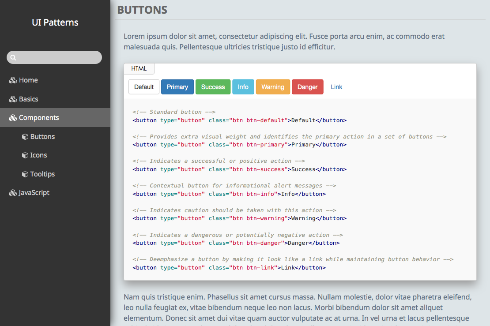

# Groot: A basic theme for hologram.

> Groot is a basic theme for Trulia's [Hologram](https://github.com/trulia/hologram), the ruby front-end doc generator, and inspired by Yoga's [Cortana](https://github.com/Yago/Cortana).

## Screenshots

Main style:



Search:


## Installation

Download directly:

```bash
curl -L -# http://jaceju.github.io/groot-theme/install.sh | sh
```

Use Bower:

```bash
bower install --save-dev groot-theme
```

## Usage

To install the last version of **Hologram** (required) :

```bash
gem install hologram
```

Your `hologram.yml` should look like :

```yaml
# The directory containing the source files to parse recursively
source: ./your-code

# The directory that hologram will build to
destination: ./styleguide

# The theme
documentation_assets: ./bower_components/groot-theme

# Any other asset folders that need to be copied to the destination
# folder. Typically this will include the css that you are trying to
# document. May also include additional folders as needed.
dependencies:
  - /public/images

# To have a custom index page build with your README.md in source folder.
# Default is `INDEX` for INDEX.md.
index: README

# List all css to include for the styleguide render examples (path from styleguide directory)
css_include:
  - '/css/vendors.css'
  - '/css/styles.css'

# List all js to include for the styleguide render examples (path from styleguide directory)
js_include:
  - 'http://code.jquery.com/jquery-1.10.2.min.js'
  - '/js/main.js'
```

We recomand to place a `README.md` in the root of your source directory to build a custom styleguide index page.

## Hacking

To hack **groot-theme**, you will need [RubyGems](http://rubygems.org/), [Bower](bower.io),  [npm](https://www.npmjs.org) and [NodeJS](http://nodejs.org/)

To setup the project:

```bash
bundle install --path=.bundle
npm install
bower install
```

Development:

```bash
gulp watch
```

Build:

```bash
gulp
```
